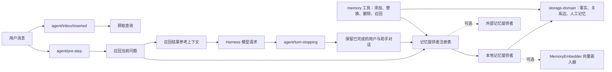

### REPO: yushenghai1106/dsh-memory-plugin  SUBDIR:   BRANCH: 
META default_branch=main stars=1 forks=0 pushed_at=2026-09-03T08:12:05Z created_at=2026-09-02T02:57:22Z license=MIT archived=False open_issues=0 homepage=
META description=Pluggable persistent memory bundle for DeepSeek Harness
RELEASE none
COMMIT cffbf61 2026-09-03T07:50:50Z :: docs: compare Hermes and DSH memory
COMMIT 7cf8e6d 2026-09-02T07:39:56Z :: docs: translate README to Chinese
COMMIT 694b7e9 2026-09-02T07:35:38Z :: fix: validate embeddings and filter short turns
TREE FILECOUNT=16
--- FILES IN SCOPE (max 120) ---
F .github/workflows/verify.yml
F .gitignore
F LICENSE
F README.md
F cordis.patch.yml
F docs/hermes-memory-comparison.zh.md
F package.json
F pnpm-lock.yaml
F src/index.ts
F src/memory-registry.ts
F src/memory-types.ts
F src/tool-memory.ts
F src/tool-types.ts
F tests/retrieval.spec.ts
F tsconfig.json
F tsdown.config.ts
=== README FROM: https://raw.githubusercontent.com/yushenghai1106/dsh-memory-plugin/main/README.md (len=2296) ===
# @yushenghai/dsh-memory-plugin

面向 DeepSeek Harness 的持久记忆插件。它支持项目事实与用户偏好的人工维护、已完成对话的自动保留、收件箱异步预取、当前问题召回、可选语义向量，以及本地实体共现图。

## 架构图



本地提供者通过当前 Harness 存储后端持久化数据，并使用独立的 `ysh_memory` 存储域，因此不会与其它记忆插件共用记录。可选的嵌入插件提供向量排序；外部提供者则可通过公开注册表替换保留和召回实现。

## 安装

```sh
dsh plugin --profile default add @yushenghai/dsh-memory-plugin
```

插件会自动加入 `cordis.patch.yml` 层。可使用下面的命令检查最终组合：

```sh
dsh --profile default --dump-config
```

## 配置

`provider: local` 启用内置的持久化提供者。仅当另一个插件注册了匹配的 `MemoryEmbedder` 时才设置 `embeddingProvider`；它会增加语义向量排序，但不会替换本地图谱。

默认补丁配置了受限的人工记忆、最多 1,000 条动态事实、自动保留和 30 秒预取缓存。可在配置文件的 `ysh-memory` 条目中覆盖这些值。

| 配置项 | 默认值 | 作用 |
| --- | ---: | --- |
| `memoryCharLimit` | 2200 | 会话开始时注入的人工项目记忆最大字符数。 |
| `userCharLimit` | 1375 | 会话开始时注入的人工用户偏好最大字符数。 |
| `recallLimit` | 4 | 每次召回返回的最大事实数量。 |
| `recallMaxChars` | 6000 | 加入模型请求的召回参考上下文最大字符数。 |
| `maxFactCount` | 1000 | 保留的动态事实最大数量；超过后优先删除最早的事实。 |
| `semanticWeight` | 0.55 | 可选嵌入提供者的语义排序权重。 |
| `lexicalWeight` | 0.20 | 共享词项的排序权重。 |
| `entityWeight` | 0.15 | 精确实体匹配的排序权重。 |
| `graphWeight` | 0.025 | 已连接实体的图谱排序权重。 |
| `prefetchTtlMs` | 30000 | 收件箱预取结果的缓存时长（毫秒）。 |
| `autoRetain` | true | 是否将已完成的用户/助手对话保留为动态事实。 |
| `autoRetainMinUserChars` | 16 | 自动保留所需的最小用户消息字符数。 |
| `autoRetainMaxChars` | 4000 | 自动保留时用户与助手内容各自的最大字符数。 |

至少应有一个排序权重大于零。修改权重时，建议让它们的总和接近 `1`，便于理解相对排序效果。

## 兼容性

此插件面向 DeepSeek Harness `0.1.2-alpha.2` 及更高版本。所选 Profile 需要包含 `@deepseek-ai/dsh-base` 提供的常规存储、Agent、LLM 与工具服务。

## 与 Hermes 的记忆系统对比

关于 Hermes 的基础记忆、外部 Provider 生态，以及本插件的图谱和向量召回边界，请阅读[从 Hermes 记忆系统到 DSH 持久记忆插件](docs/hermes-memory-comparison.zh.md)。

## 发布

```sh
pnpm install
pnpm run typecheck
pnpm run build
pnpm publish --access public
```

从 Git 安装时，`prepare` 会构建插件。使用者必须在其 Profile 的 `pnpm-workspace.yaml` 中显式允许该构建；使用已包含 `dist/` 的 npm 发布包则不需要此授权。

