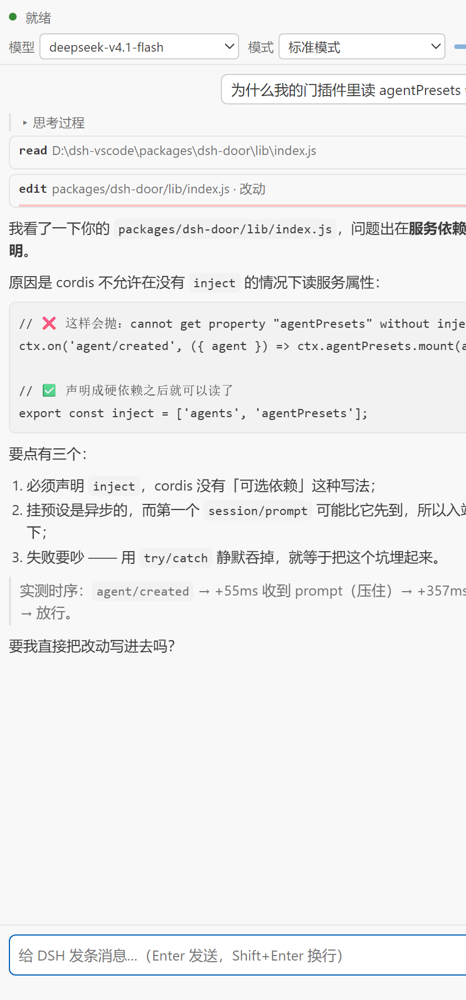
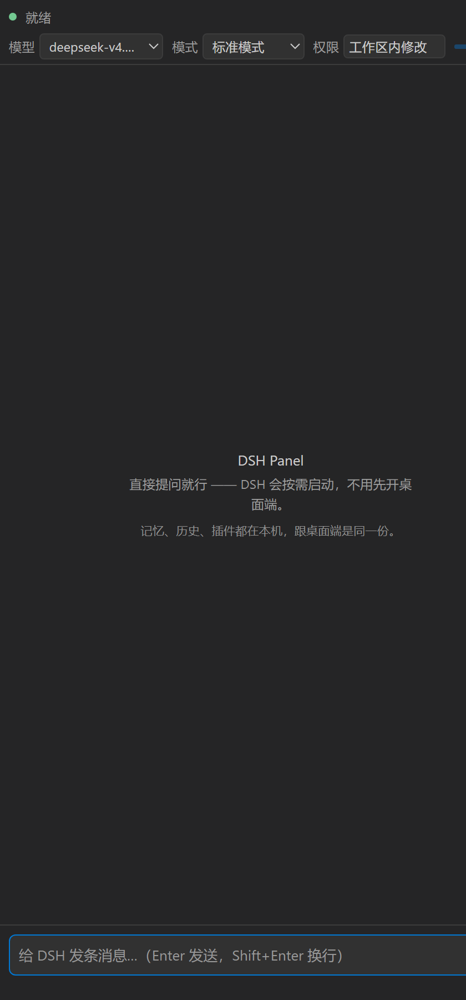
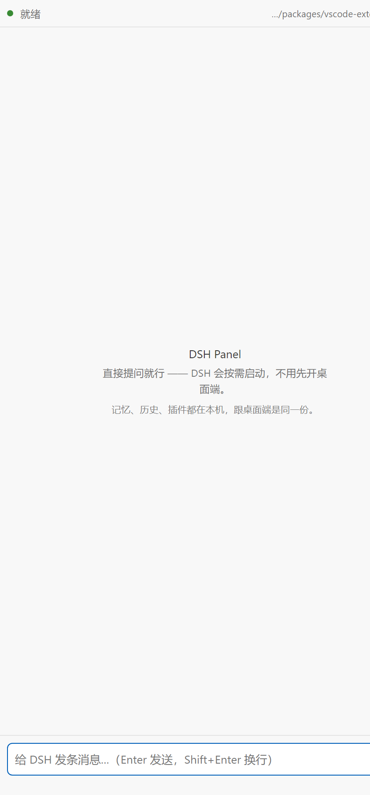

# DSH Panel

在 VS Code 的侧边栏里直接使用 DeepSeek Harness。

**无需先在桌面端启动 DSH**：打开侧边栏即可提问。内核由扩展按需启动，
记忆、会话记录与插件均来自用户自己的 `$DSH_HOME`，与桌面端为同一份。
桌面端处于运行状态时，面板直接连接该进程（一个进程、一个内核），不会另起第二个。

本扩展不是另一个 agent，也不会另起一套记忆：同一份配置、同一份记忆、
同一份会话记录、同一套工具与权限策略。



| 权限模式（会话中途可切换） | 历史会话（点击一条即可接回上下文） |
| --- | --- |
|  |  |

<details>
<summary>English</summary>

**DSH Panel** puts [DeepSeek Harness](https://github.com/deepseek-ai) (DSH) in the
VS Code sidebar. You do not have to start the desktop app first — the extension
starts a DSH kernel on demand, or attaches to the one already running.

It is not another agent and it does not keep a second memory: same `$DSH_HOME`,
same sessions, same plugins, same tools and permission policy as the desktop app.
Model, agent preset and permission mode are read from the running kernel (not
hard-coded), and the permission mode can be switched mid-conversation.

To connect, DSH needs the companion plugin **`dsh-acp-door`**, which opens a
loopback-only ACP port inside the kernel (`dsh plugin --profile <profile> add
dsh-acp-door`). Only `127.0.0.1` is ever listened on; there is no authentication,
so it is meant for your own machine.

Requires VS Code 1.85+ and a local DSH install. UI text is Chinese today.

</details>

## 连接方式

```
VS Code 侧边栏（本扩展）
        │  ACP（JSON-RPC，一行一个 JSON）
        ▼
   ACP 接入点插件（dsh-acp-door）    ← 安装在 DSH 内核中的插件
        │  在本机回环端口 47821 上再提供一份 ACP 桥接
        ▼
   DSH 内核                          ← 桌面端内核，或者扩展自行启动的内核
```

- 该插件**只监听本机回环地址**，不接受外部连接。
- **端口上已存在该插件时直接复用**（桌面端运行时即为此种情况，不会多起进程）；
  **端口上不存在该插件时自行启动一个内核**，使用 `dshPanel.fallbackProfile`
  （默认 `vscode-panel`，即面板自己的档，从官方 web 模板创建，已安装该插件与用户使用的其他插件）。
- **面板自行启动的内核使用独立端口**（`dshPanel.selfStartPort`，默认 47831），
  不与桌面端的 47821 争用：两个内核争用同一端口没有收益，争用失败一方的插件
  将不启动，对话流停留在"正在启动…"并持续等待。扩展启动内核时把该端口写入环境变量
  `DSH_ACP_DOOR_PORT`，该插件优先读取该变量（要求插件 0.0.11 及以上；旧版本不识别该变量，
  此时面板会同时监听两个端口，连接仍可建立）。
- **关闭侧边栏不等同于回收内核**（2026-09-19 修改，见下文）：折叠侧边栏、拖动面板、
  `Reload Window` 均只释放面板对内核的引用，内核继续运行；在宽限期（`dshPanel.kernelIdleMinutes`，
  默认 10 分钟）内重新打开面板即可继续使用同一进程。仅在**关闭 VS Code 窗口**、
  宽限期到期、或者用户执行「DSH：停止后台内核」时才真正回收。
  桌面端的内核（47821）在任何情况下均不回收。
- 若需要面板始终使用自行启动的内核（不连接桌面端的内核），把 `dshPanel.autoStart` 保持
  打开，并将 `dshPanel.port` 改为桌面端未使用的端口。
- **自行启动失败时会依次尝试其他档**：设置中的档排第一位（保留用户的选择），启动失败则
  在 `$DSH_HOME/profiles` 中查找一个已安装该插件、且为网页档的档继续尝试。内核自身
  上报的错误（退出码 + stderr）会被读取并照实转述，不做推测。

### 面板关闭时终止内核的处理方式及其问题（2026-09-19）

此前 `dispose()` 中直接 `killTree` 掉自行启动的内核。而**面板的销毁比预期频繁**：
折叠侧边栏、把面板拖到另一个位置、`Reload Window`、另一个窗口关闭，每一次
都会触发"终止内核 + 重新连接"。用户观察到的现象是"会话进行中突然断线"，且出现时机随机。

当前内核的归属划分如下：

| 内核来源 | 回收方 |
| --- | --- |
| 桌面端的内核（47821） | 桌面端自身。扩展仅连接，不回收 |
| 另一个 VS Code 窗口启动的面板内核 | 该窗口。本窗口仅连接 |
| **本窗口启动的**面板内核 | 本扩展。最后一个使用者释放引用后进入宽限期（默认 10 分钟），到期回收；窗口关闭时立即回收 |

验证该行为的测试：`test/kernel-manager.js`（假进程，26 项）与
`test/fallback.js` §6（真进程：销毁面板后内核必须继续运行，重新打开面板必须复用
同一个 pid）。

### 长时间运行测试（`tools/soak.cjs`）

"能够启动但运行时间不足"这类问题，功能测试无法覆盖。该工具用于连续运行并执行回合：

```powershell
# 使用生产档运行 10 分钟，每 40 秒执行一个真实回合
node tools/soak.cjs --profile vscode-panel --minutes 10 --turn-every 40
# 更换端口，同时验证"该插件读取环境变量"（档中配置 47830，环境变量指定 47831）
node tools/soak.cjs --profile vscode-panel --port 47831 --patch <将 47830 端口写入配置的 patch 文件> --minutes 2
```

运行结束后输出：成功与失败回合数、内核是否自行退出、断线次数、内核退出前的输出。
（2026-09-19 使用该工具运行两轮、每轮 10 分钟：生产档 10 回合 0 断线、最小档 10 回合
0 断线。用户报告的"35 秒即退出"未能复现，见交接文档。）


### ACP 接入点插件的目标档选择

该插件安装在哪个 profile 中，面板就能连接哪个 profile 的 DSH。

**问题（2026-09-19）**：最初的默认值为 `desktop` 档，考虑是"与桌面端使用同一档，
记忆、技能与插件完全一致"。但该档**由桌面端独占**，普通命令行无法启动：

```
error: profile "desktop" is managed exclusively by the Electron application
```

因此在"桌面端未运行"的情况下面板必然无法启动，而该场景恰恰最需要面板自行启动。
当前的做法：

- 面板使用自己的档 **`vscode-panel`**（通过 `dsh --profile vscode-panel
  --from-default-profile web` 创建，再通过 `dsh plugin --profile vscode-panel add
  <插件包名>` 安装该插件，以及用户使用的其他插件），命令行可以启动，也可以开启 TCP 接入端口；
- PATH 上的 `dsh` 是**桌面端自身的启动垫片**（`DSH Desktop.exe` 以
  `ELECTRON_RUN_AS_NODE` 运行 `desktop-cli.js`），它可以运行 `desktop` 档，
  但它位于一个带哈希的一次性目录中，桌面端更新后路径随之变化，因此启动较早的
  VS Code 可能仍指向已被删除的版本：`dsh` 找不到、`node bin.js` 拒绝
  `desktop` 档，**两种方式同时失败**。这就是该 bug 的完整成因。

**注意**：插件在内核启动时加载。安装完成后，已在运行的桌面端不会立即提供接入点，
应当重启一次桌面端（得到单进程、单内核的状态），
或者让扩展自行启动一个内核（记忆相同，仅多一个进程）。

### 受限模式（Restricted Mode）的兼容性

清单中声明了 `capabilities.untrustedWorkspaces.supported = true`。

该声明具有实际作用：**未声明该字段的扩展在 VS Code 的受限模式中会被完全禁用**，
表现为"面板不加载且无报错"，排查困难（在隔离窗口中实际观察到：
同一个扩展，不带工作区文件夹时可以激活，带一个未被信任的文件夹时完全不加载）。
本扩展不执行工作区中的代码：读取工作区文件仅发生在用户主动右键「带进对话」时，
设置也只读取用户级设置（受限模式下 VS Code 不套用工作区设置）。

## 安装

1. **安装本扩展**：在市场搜索 `DSH Panel`，或使用命令行
   `code --install-extension <publisher>.dsh-panel`。
2. **为 DSH 安装配套插件**（只需执行一次）：

   ```sh
   dsh plugin --profile <档名> add dsh-acp-door
   ```

   未安装该插件时面板仍可使用：面板会自行启动内核，但该档中同样需要安装该插件，
   否则面板无法连接任何 DSH，只会在对话流中提示「未安装连接组件（`dsh plugin --profile
   <档名> list` 中应当有 `dsh-acp-door`）」。
   安装的档决定了面板能够连接哪个档的 DSH（详见下文「ACP 接入点插件的目标档选择」）。
3. 打开侧边栏，直接提问。

## 用法

1. 点击侧边栏的 DSH 图标（活动栏中的对话气泡图标）。
2. 直接提问。Enter 发送，Shift+Enter 换行。
3. 顶栏显示模型下拉与上下文用量；右上角为「新建对话」与「重新连接」。
4. 连接中途断开（例如 DSH 重启）时无需干预：下次发送会自动重连，
   并**自动接回原会话**（ACP 的 `session/resume` 实测可保留上下文）。
   若无法接回（内核中已不存在该会话），面板会明确提示「上一段会话未能恢复，此处为新对话。」，
   不会静默替换为一段没有记忆的新对话。

### 将编辑器内容带入对话

提供两个命令（可在命令面板中搜索 `DSH`，或在**编辑器内右键**）：

| 命令 | 可用条件 | 带过去的内容 |
| --- | --- | --- |
| `DSH：把选中的代码带进对话` | 编辑器中有选区时 | 选中行的**正文** + 该文件的链接 |
| `DSH：把当前文件带进对话` | 已打开文件时 | 仅提供该文件的链接，由 DSH 自行读取 |

带过去的内容会显示为输入框上方的一个小块，点击 `×` 可以移除；发送之后，
该消息气泡中仍保留当时带入的清单。

两者的区别在于：**选区代码量小，且用户的意图通常就是"仅这几行"，直接提供正文对模型最准确**；
**整个文件可能很大，只提供一条链接（ACP 的 `resource_link`），由 DSH 使用自身工具读取** ——
不占用上下文，读取到的始终是最新版本。

### 权限与确认

工具调用是否需要确认，取决于用户所用 profile 的权限策略（桌面端安装了 `auto-approval`，
默认不打断）。面板在内核实际发起询问时弹出选项，也会将代码改动渲染为 diff。

**顶栏另有一个「权限」按钮**（与桌面端功能相同）：点开后显示内核中的权限预设
清单，桌面端具有的档在此处同样具有：

| 档 | 含义 | 来源 |
| --- | --- | --- |
| 仅可查看 | 可读取任何位置，但不修改任何内容 | 内核自带 |
| 工作区内修改 | 可在工作区/临时目录内写入，越界时先询问 | 内核自带 |
| Auto Approval | 可在工作区内写入，并自动批准无害的命令 | `dsh-auto-approval-plugin`（安装后才存在） |
| 完全权限 | 不再询问，可执行任何操作 | 内核自带 |

以下是若干有意为之的设计：

- **清单不在面板中硬编码**，而是在每次创建会话时从内核读取（`dsh-door/permission/get`）。
  因此用户或某个插件向内核新增档之后，面板立即显示该档，不会出现中文名乱码、
  少一项这类错位。清单中无法识别的档（例如插件新增的档）原样显示内核提供的名称与说明。
- 内置三档的说明文字为**翻译后的中文**（桌面端显示内核中的英文原文），
  这是唯一一处刻意与桌面端不同的地方，目的是减少英文阅读。
- **点击「完全权限」时会先确认一次**（与桌面端一致）：该档意味着不再逐条确认，
  误选代价较高，因此确认步骤放在**客户端**而不是内核中。
- 权限切换**随时可执行，且对当前会话立即生效**（与「模式」不同，模式无法更改当前会话）。
  切换结果以**内核回读的**为准，失败时明确说明并回到实际状态。
- 连接到的该插件版本过低（低于 0.0.12，例如**桌面端档中的该插件**）时，
  按钮变为灰色的「切不了」，悬浮提示与对话流中说明原因与升级方法
  （顶栏该位置仅有 4 个字的宽度，无法容纳原因，见「面向用户的文案长度上限」）。
  此时仍可在**桌面端自身的界面**中切换，该界面不使用该插件这条路径。

## 设置

| 设置项 | 默认值 | 说明 |
| --- | --- | --- |
| `dshPanel.host` | `127.0.0.1` | 该插件的监听地址 |
| `dshPanel.port` | `47821` | 该插件的端口，须与插件中配置的端口一致 |
| `dshPanel.autoStart` | `true` | 端口上不存在该插件时自行启动内核（启用后无需先启动桌面端） |
| `dshPanel.fallbackProfile` | `vscode-panel` | 自行启动内核时使用的 profile（其中须安装该插件）。**不应填写 `desktop`**，该档由桌面端独占，命令行无法启动 |
| `dshPanel.dshCommand` | `dsh` | `dsh` 命令的名称或完整路径 |
| `dshPanel.provider` / `dshPanel.model` | 空 | 新会话的初始模型，留空由内核决定 |
| `dshPanel.cwd` | 空 | 新会话的工作目录，留空使用当前工作区 |

## 命令

- `DSH：新建对话` —— 关闭当前会话并新建一个会话。
- `DSH：重新连接` —— 断开后重新连接（在修改端口或刚启动 DSH 之后使用）。
- `DSH：查看日志` —— 打开输出面板中的 DSH Panel 通道，出现问题时在此查看。

## 当前范围与限制

- **仅连接本机**，没有鉴权机制。因此仅适用于本机使用。
- 面板中的**预设（preset）**跟随该插件的配置，不能在会话中途切换：
  内核的 `agentPresets` 在首个回合之后会锁定（`agent-preset/locked`），
  并且 ACP 未将预设暴露为可选配置项。
- **权限模式**：ACP 同样未暴露该配置（ACP 仅支持模型与推理强度两个 config option），
  因此该项为连接组件在内核之外提供的旁路方法，**要求 `dsh-acp-door` 0.0.12 及以上**。
  所连接的内核版本过低、无法切换权限时，面板会**自动改用自行启动的内核**（该内核的组件
  为与本扩展配套的新版本），因此「连接桌面端内核」不会导致权限选择器缺失；
  代价是该时刻会多一个内核进程。确实无法切换（例如该 DSH 未提供权限设置）时，
  按钮显示为灰色的「切不了」，原因以简述文本说明（不出现「门」「包名」「版本号」）。
- **界面文案中不得出现内部术语**（用户 2026-09-20 的原话为「『门』都出来了，别人能知道是什么意思？类似的提示全删了」）。因此界面文案中不得出现：连接组件名
  （「门」）、包名（`dsh-acp-door` / `dsh-base` / `@deepseek-ai/*`）、版本号
  （`0.0.12`）、「档」（profile）、设置项全名、「内核原话」这种仅内部使用的说法。
  **内核自身输出的原文不在此列**：它保存在「原始报错（展开）」折叠区与日志中，
  一个字都不删除，属于证据而非讲解。该规则由三个测试保证
  （`test/permission.js` §6 黑名单、`test/panel.js` §8.7 与 §8.9 检查实际发出的消息、
  `tools/uitest.js` 检查渲染出的悬浮提示）。
- **历史会话列表**可列出本机 `$DSH_HOME/sessions` 中的会话（标题、时间、回合数、
  工作目录），点击一条即可接回上下文。连接本机时由面板直接读取磁盘，不需要该插件
  支持新方法。连接**其他机器**上的该插件时，只能依赖该插件提供 `dsh-door/sessions/*`（0.0.8+）；
  该插件版本过低时，面板只返回一句提示：该 DSH 版本过低，无法读取其历史会话。
- 顶栏仅显示**简短状态**（就绪 / 工作中 / 未连接）。报错原文与诊断信息进入对话流，
  长原文收在「原始报错（展开）」的折叠区中，不占用顶栏空间。访问令牌、密钥、口令等敏感
  参数的值会替换为「[已隐藏]」，其余内容保持原样。
- **面向用户的文案长度上限**（用户提过两次意见，2026-09-19 确定该规则）：

  | 位置 | 上限 | 示例 |
  | --- | --- | --- |
  | 顶栏状态 | ≤ 24 字，不允许换行 | `正在启动…`、`就绪` |
  | 对话流提示第一行 | ≤ 32 字 | `正在启动 DSH…`、`继续使用当前正在运行的 DSH。` |
  | 提示中引用的内核原话 | 另起一行，≤ 80 字 | `原因：…` |
  | 报错标题 / 处理方式 | ≤ 32 / ≤ 48 字 | `额度或频率已达上限，本回合未完成。` |

  使用哪个档、哪个命令、哪个端口这类**排障细节**一律只写入日志（`DSH：查看日志`）
  或折叠区；面板中不再出现「没有现成的内核，正在启动一个（档：vscode-panel）。
  第一次会慢一点，之后就快了。」这类长句。该规则由两个测试保证
  （`test/panel.js` §8.9 检查本次运行中**实际发出的全部消息**、
  `test/fallback.js` 检查自启路径），文案加长会直接导致测试失败。
- **两个内核并存的情形**（`autoStart` 打开时）：面板先连接 `dshPanel.port`（47821）上
  已存在的内核。桌面端运行时该内核即桌面端的内核；若该内核无法切换权限，面板会改用
  自行启动的内核（位于 `selfStartPort`）。因此在「桌面端 + VS Code 面板」同时
  运行、而桌面档中的连接组件为旧版时，机器上会存在两个内核：一个属于桌面端，
  一个属于面板。若只需一个内核，应将桌面档中的连接组件一并升级
  （该档由桌面端管理，升级后需要重启桌面端）。
- **顶栏配置行的宽度分配**（同日确定，用户第二次反馈为「模型的占地有点大，
  其他两点有点小」）：三个格子按 7:6:6 分配，各自设有**下限**（模型 116 / 模式 96 /
  权限 108），用量条位于最后、**空间不足时自动换行**（优先增加顶栏一行小条，
  不压缩文字）；面板宽度小于 360px 时收起「模型 / 模式 / 权限」三个标签，
  剩余宽度全部分配给控件。上述规则在 `tools/uitest.js` 的 access 场景中有断言检查
  （各 ≥100px、模型不超过模式格的 1.4 倍、按钮文字不截断、配置行不横向溢出）。
- 不支持图片粘贴（内核实测 `promptCapabilities.image = false`）。

## 故障处理

1. 先运行 `DSH：查看日志`，检查是否存在连接失败或握手异常的记录。
2. 手动确认该插件是否在监听：`Test-NetConnection 127.0.0.1 -Port 47821`。
3. 确认该插件已安装：`dsh plugin --profile <档名> list`。
4. **对话流中显示「DSH 自己退出了（code=…）」** → 面板自行启动的内核已退出。
   其后通常紧接内核最后的输出（内核原文）。查看全文：

   ```powershell
   node tools/panel-log.cjs --grep 内核
   ```

   内核没有任何输出即退出，通常意味着**该进程由外部终止**（而非自身崩溃），
   例如人工执行 `taskkill`、系统清理工具、或者杀毒软件。
5. **对话流中显示「那是别处的 DSH（通常为桌面端）已退出或重启。」** →
   断线来自桌面端内核的退出或重启，与面板无关。直接发送消息，
   面板会自行启动内核并接回上下文。

## 开发

本扩展为**纯 JavaScript、零运行时依赖、无构建步骤**，修改文件后直接重载窗口即可。

一条命令运行全部测试（内核未启动时，测试会按需自行启动内核，运行结束后自行回收）：

```powershell
node test/run-all.js        # 快速套件：静态契约、拼块单测、Markdown 单测、面板层，约 15s
node test/run-all.js --ui   # 追加真实浏览器中的界面断言（需要 Chrome）
node test/run-all.js --all  # 追加真进程的自启内核、断线接回、模式、权限预设、端到端，约 4 分钟

# 真实 VS Code 隔离窗口中的端到端自检（不影响用户正在使用的窗口）。**发版前应带上 --linger**：
$env:DSH_PANEL_CHECK_PORT = '47830'
$env:DSH_PANEL_CHECK_PROFILE = 'vscode-panel'
$env:DSH_PANEL_CHECK_DSH = 'node C:\Users\Lenovo\.dsh\profiles\node_modules\@deepseek-ai\dsh\lib\bin.js --patch %TEMP%\dsh-panel-test-door-47830.yml'
$env:DSH_PANEL_CHECK_LINGER = '90'      # 创建会话之后再持续观察 90 秒
node tools/vscode-check.js

# 查看面板自身的日志（「输出 → DSH Panel」），内核原文在其中
node tools/panel-log.cjs                # 最新一条，最后 60 行
node tools/panel-log.cjs --grep 内核     # 仅显示内核相关的行
node tools/panel-log.cjs --list         # 列出每个窗口的面板日志
```

**`--linger` 的用途**：2026-09-19 用户报告「聊两句就 `read ECONNRESET`」，
查看日志发现**每个自启内核均在启动约 35 秒后以 code=1 退出**。
而该自检此前只观察到「会话建出来了」（约 15 秒）即结束，
即「内核可以启动但运行时间不足」这类问题，原自检**无法发现**。
现在该自检会继续观察 90 秒，并断言该期间内核持续存在、连接未发生中断。
测试通过只代表"到该时刻为止没有问题"，不代表"后续一分钟同样没有问题"。

单独运行某个套件：

```powershell
node test/static.js      # 静态契约：HTML id ↔ 取元素、消息协议双向、CSS 类、零硬编码颜色
                         #   以及「扩展默认端口/主机 = 该插件实际监听端口/主机」这类跨文件约定
node test/sessions-parity.js  # 两份「历史会话读取」实现（该插件的 ESM + 面板的 CJS）必须逐项一致
node test/spawn-quote.js # 含空格的命令路径（真进程）：构造一个含空格的 .cmd 垫片并实际运行
node test/markdown.js    # Markdown 渲染器：语法、注入安全、病态输入不会死循环、实际耗时
node test/blocks.js      # 编辑器上下文拼块：选区正文、resource_link、围栏加长、异常数据
node test/session.js     # 会话层边界（假客户端）：切换模型以内核回复为准、用量帧只提供一半、帧的归属与合并
node test/panel.js       # 面板层集成：注入假 vscode，连接真实的该插件
node test/fallback.js    # 自启内核：端口空闲时能否从零启动、执行一个真实回合、结束时能否完全回收
                         #   默认使用 47821；该端口被占用（桌面端运行时）时，改用空闲端口运行：
                         #   $env:DSH_PANEL_TEST_PORT = '47830'; node test/fallback.js
node test/resume.js      # 断线后 session/resume 能否恢复上下文（带对照组）
node test/presets.js     # 模式（agent preset）：新会话挂载、恢复会话补挂、工具未丢失
node test/permission-live.js  # 权限预设（连接组件 0.0.12+）：自行启动内核，四个档全部切换一遍，
                         #   两段会话互不影响，错误名称/错误会话均须明确报错
                         #   另有一套纯函数断言检查「已连接的内核无法切换权限时是否需要改用其他内核」
                         #   （test/panel.js §8.86；真窗口路径见 tools/vscode-check.js）
node test/smoke.js       # 端到端：协议、真实回合、工具调用、中断、切换模型、多轮、
                         #   以及编辑器上下文（选中代码中的标记 + 带入文件中的标记）
node tools/uitest.js     # 在无头 Chrome 中对界面执行 400+ 项断言（10 个场景，含通用视觉检查：
                         # 文字截断 / 按钮尺寸过小 / 浮层超出面板 / 消息间距不一致）
                         #   其中 access 场景实际打开权限选择器：四个档均存在、当前档被选中、
                         #   完全权限需先通过确认步骤、Esc/点击外部可关闭、无法切换时按钮置灰
node tools/uitest.js access  # 仅运行「权限选择器」场景
node tools/uitest.js context  # 仅运行「带编辑器上下文」场景
node tools/shots.js      # 将每个场景 × 深/浅主题截图保存（shots/*.png），
                         # 用于人工查看与改动前后对比。指定场景名可只截取一个场景。
node tools/design-audit.js  # 界面尺度审计：字号/间距/行高/圆角各有几种、有没有硬编码颜色。
                         # 界面调整阶段用于量化"改前改后"；加 --strict 时存在硬编码颜色则以非 0 退出。
node tools/build-vsix.js # 打包为 vsix（用于本地安装；需要打进包内的文件清单在 tools/ship-list.js，
                         # 仅此一份；市场侧使用 vsce + .vscodeignore，两个清单必须一致）
node tools/make-icon.cjs # 生成市场使用的 media/icon.png（128×128）。活动栏的 svg 为单色
                         # + currentColor，直接作为市场图标不可见，因此需要由它转换为彩色图像。
node tools/publish.js    # 市场发布：不加参数为预演（自检 + vsce 打包 + 与上述清单逐文件比对），
                         # 加 --yes 才实际发布（需要 VSCE_PAT；占位符未填写会被拒绝）

# 以下四个用于「排查」，不属于测试套件，也不打进 vsix（仅发布 ship-list.js 中的内容）。
# 它们运行于本机真实环境，因此仅适合手动运行：
node tools/check-installed.cjs     # 安装到 VS Code 的副本与仓库源码是否逐字节一致
                                   # （用于判断"用户运行的版本是否为当前源码"，曾出现"修改源码但未安装"）
node tools/check-local-history.cjs # 面板"直接读盘"路径在本机上的实际结果：
                                   # 磁盘上的片段数、读取到的片段数、是否存在解码失败、耗时、被列表上限截断的数量
node tools/who-owns-door.cjs       # 47821 上该插件的启动方（桌面端自身的内核或测试残留的孤儿进程）
                                   # 该插件未启动时，输出会说明面板将自行启动内核
node tools/check-eol.cjs           # 是否存在文件混用 CRLF 与 LF（逐字节比对对此敏感；混用时以非 0 退出）
                                   # 从任何目录运行结果相同，不依赖当前工作目录
# tools/vscode-check.js 为真窗口自检，用法见文件开头：
#   自启模式（共 15 项）：   $env:DSH_PANEL_CHECK_PORT='47832'; node tools/vscode-check.js
#   连接旧版插件→更换内核（共 16 项）：$env:DSH_PANEL_CHECK_PORT='47821'
#                              $env:DSH_PANEL_CHECK_SELF_PORT='47832'
#                              $env:DSH_PANEL_CHECK_PROFILE='vscode-panel'
#                              node tools/vscode-check.js
#   （后者验证「已连接内核无法切换权限 → 改用自行启动的内核 → 读取权限」这一流程）

node tools/vscode-check.js  # **真实 VS Code 窗口内**的自检：开启一个隔离窗口（独立的 user-data-dir 与
                            # extensions-dir，不影响用户正在使用的窗口），通过 DSH_PANEL_AUTOFOCUS=1 使
                            # 面板自动展开，断言 15 条：窗口启动 / 扩展激活 / 六个命令注册 /
                            # 视图进入活动栏 / 面板展开 / ACP 握手 / 会话创建成功 /
                            # 权限路径有结果（读取到清单，或者明确说明无法切换的原因）/
                            # 内核归属（端口上存在该插件时为「接入模式：连接正在运行的该插件，没有另起内核」，
                            # 不存在时为「自启模式：自行启动了 DSH 内核」）/ 结束运行干净 /
                            # 不残留孤儿内核 / 用户自身的窗口未被影响。约 30 秒，结束后自动回收。
                            # 加 --keep 可保留窗口以便查看。
                            # **不终止任何内核**：仅回收自建的隔离窗口，其余仅报告，
                            # 依据名称或参数执行 taskkill 可能误删用户正在使用的内核。
                            #
                            # 桌面端运行时如需验证「自启模式」（用户最常使用的路径），将本次自检
                            # 指向一个空闲端口即可：这三个环境变量只写入**隔离窗口自身的
                            # settings.json**，用户设置不做任何修改：
                            #   $env:DSH_PANEL_CHECK_PORT = '47830'
                            #   $env:DSH_PANEL_CHECK_PROFILE = 'dshdoor'
                            #   $env:DSH_PANEL_CHECK_DSH = 'node <bin.js> --patch <将 47830 端口写入配置的 patch 文件>'
                            # 2026-09-19 实测：这两条路径各 11 项全部通过（自启路径 11 秒创建会话）。
```

调试用自检开关：设置环境变量 `DSH_PANEL_AUTOFOCUS=1` 后启动 VS Code，
扩展会自动展开面板一次，因此无人值守时也可以验证「安装 → 激活 → 打开面板 → 连接成功」
整条链路，无需手动点击。

```powershell
$env:DSH_PANEL_AUTOFOCUS='1'; code --new-window .
```

测试使用的档、端口、命令均可通过环境变量覆盖（默认指向 `dshdoor` 测试档，
**刻意不使用 `desktop`**：测试不应当具有启动用户实际使用档的权限）：

```powershell
$env:DSH_PANEL_PROFILE='dshdoor'; $env:DSH_PANEL_PORT='47821'; node test/run-all.js --all
```
