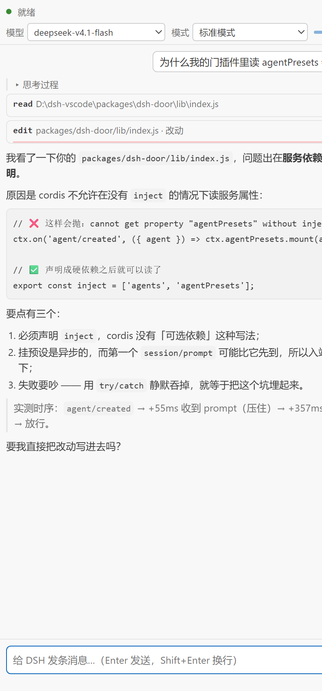
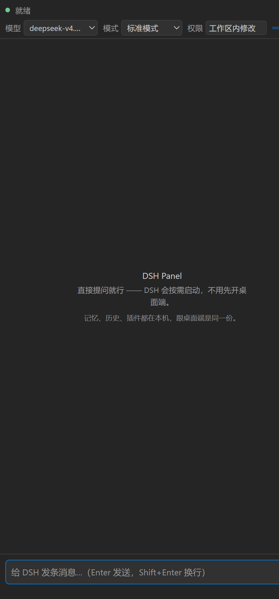
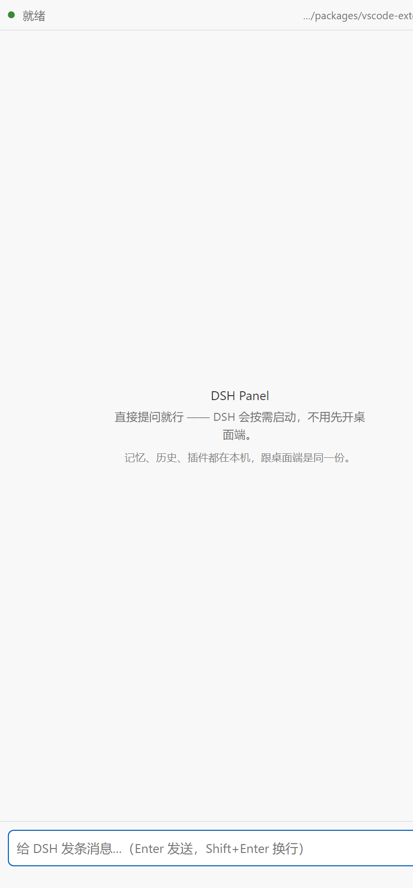

# DSH ACP Panel

把 **DeepSeek Harness（DSH）** 带进 VS Code。

直接在侧边栏对话、调用工具、切换模型与权限，并继续本机历史会话。面板可以连接正在运行的 DSH，也可以按需启动本机 DSH，不要求预先打开桌面端。



| 权限模式 | 历史会话 |
| --- | --- |
|  |  |

## 核心功能

- **侧边栏对话**：在 VS Code 内发送消息、查看 Markdown 回复和工具执行过程。
- **编辑器上下文**：通过右键菜单把当前文件或选中的代码带进对话。
- **模型与模式**：从内核提供的选项中选择模型和对话模式。
- **权限控制**：查看并切换当前会话的权限；高风险模式切换前会再次确认。
- **历史会话**：浏览保存在本机的 DSH 会话，并接回原有上下文。
- **自动连接**：优先连接正在运行的 DSH；不可用时可按设置启动本机配置集。
- **断线恢复**：DSH 重启或连接中断后，下一次发送时自动重连并尝试恢复会话。

## 安装

本扩展需要本机已安装并配置好 DSH，同时需要配套的 `dsh-acp-door` 插件提供本机连接。
当前版本兼容 DSH `0.1.5-rc.2` 与 `0.2.0-rc.1`。

### 1. 准备 DSH 配置集

若希望在桌面端未运行时也能使用面板，建议创建独立的 `vscode-panel` 配置集，并安装配套插件：

最简单的方式是在安装扩展后打开命令面板，运行 **DSH：准备或修复自启配置**。它会创建
缺失的 web 配置集，并安装或更新配套插件；已有同名非 web 配置集不会被覆盖。

也可以手工执行：

```sh
dsh --profile vscode-panel --from-default-profile web --dump-config
dsh plugin --profile vscode-panel add dsh-acp-door
dsh plugin --profile vscode-panel list
```

请先在 DSH 中配置可用的模型。不要把自启配置集设为 `desktop`，该配置集由桌面端管理，不能由命令行启动。

如果桌面端使用的配置集已经安装配套插件，重启一次桌面端后，面板会优先连接正在运行的 DSH。

### 2. 安装扩展

在 VS Code 扩展市场搜索 **DSH ACP Panel**，或运行：

```sh
code --install-extension Elk-ydy.dsh-acp-panel
```

使用本地 `.vsix` 安装时：

```sh
code --install-extension <文件路径>.vsix --force
```

安装完成后执行一次 **Developer: Reload Window**。

### 3. 开始使用

点击活动栏中的 DSH 图标，输入问题并按 `Enter` 发送；使用 `Shift+Enter` 换行。

## 常用操作

- 点击右上角 `+` 新建对话。
- 点击时钟图标浏览并接回历史会话。
- 在编辑器中右键，选择 **DSH：把选中的代码带进对话** 或 **DSH：把当前文件带进对话**。
- 使用顶栏控件切换模型、模式和权限。
- 在命令面板中搜索 `DSH`，可准备自启配置、重新连接、查看日志或停止面板启动的后台 DSH。

## 设置

打开 VS Code 设置并搜索 `DSH Panel`。

| 设置项 | 默认值 | 用途 |
| --- | --- | --- |
| `dshPanel.autoStart` | `true` | 没有可用连接时，允许面板启动本机 DSH |
| `dshPanel.fallbackProfile` | `vscode-panel` | 面板自行启动时使用的配置集 |
| `dshPanel.dshCommand` | `dsh` | 自动发现失败时使用的 DSH 命令覆盖项 |
| `dshPanel.kernelIdleMinutes` | `10` | 面板关闭后保留自启 DSH 的分钟数 |
| `dshPanel.port` | `47821` | 连接已运行 DSH 的本机端口 |
| `dshPanel.selfStartPort` | `47831` | 面板自行启动 DSH 时使用的本机端口 |
| `dshPanel.provider` / `dshPanel.model` | 空 | 为新会话成对指定初始模型；留空由 DSH 决定 |
| `dshPanel.preset` | 空 | 新对话使用的模式；留空使用 DSH 默认值 |
| `dshPanel.cwd` | 空 | 新会话的工作目录；留空使用当前工作区 |

通常只需确认 `fallbackProfile`。DSH Desktop 0.2 的安装目录和随附运行时会被自动发现；
只有自动发现失败时才需设置 `dshCommand`。端口设置仅在本机已有端口冲突或使用了自定义配置时修改。

## 本机数据与安全

- 连接仅限 `127.0.0.1` / `localhost`，不支持连接远程 DSH。
- 本机连接没有身份验证，不应通过端口转发、隧道或局域网暴露。
- 会话、记忆和模型配置由本机 DSH 管理，扩展不会提供云端同步。
- 自启配置集与桌面端共用同一份 `$DSH_HOME`，但配置集内的插件和补丁需要分别安装。
- 编辑器文件或选区只会在你主动执行“带进对话”时作为上下文附加。

## 要求与限制

- VS Code 1.85 或更高版本。
- 本机已安装 DSH，并配置了可用模型。
- 当前界面语言为中文。
- 当前不支持粘贴图片。
- 完整端到端验证环境为 Windows；其他系统尚未作为已验证兼容性承诺。

## 故障处理

1. 在命令面板运行 **DSH：查看日志**，查看连接或启动失败的原因。
2. 运行 `dsh plugin --profile vscode-panel list`，确认配套插件已安装。
3. 安装或更新配套插件后重启对应的 DSH；更新扩展后执行 **Developer: Reload Window**。
4. 运行 **DSH：准备或修复自启配置**，自动创建或更新 `vscode-panel`。
5. 如果自动发现仍失败，再在 `dshPanel.dshCommand` 中填写完整启动命令。

仍有问题时，请在 [GitHub Issues](https://github.com/elk-9527/dsh-vscode/issues) 提交日志和复现步骤。版本变化见[更新记录](CHANGELOG.md)。

<details>
<summary>English</summary>

DSH ACP Panel brings DeepSeek Harness into the VS Code sidebar. Chat with DSH, attach editor context, switch models and permissions, and resume local sessions without opening the desktop app first.

It requires VS Code 1.85+, a local DSH installation, and the companion `dsh-acp-door` plugin. Connections are loopback-only and are intended for use on your own computer. The current UI is Chinese.

</details>
